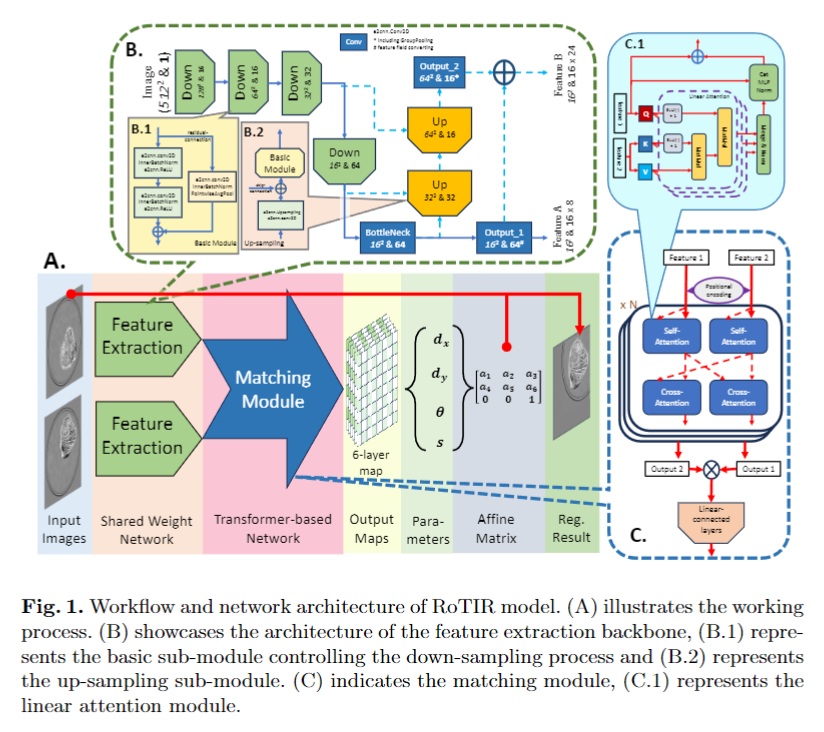
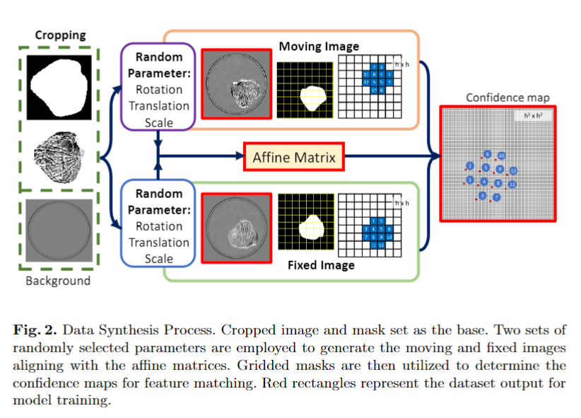
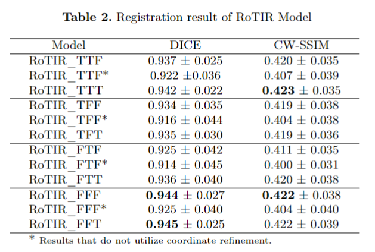
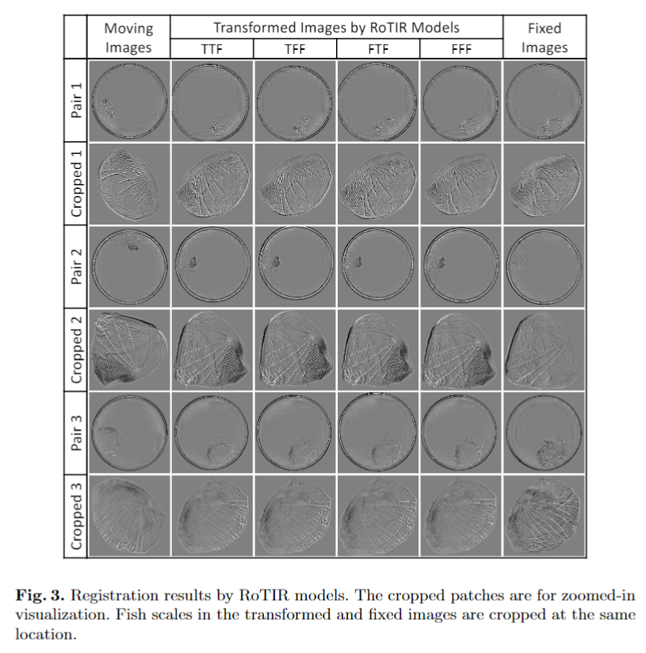
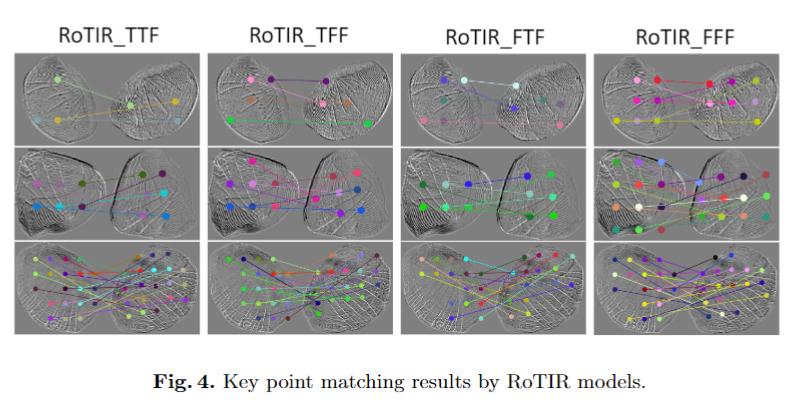

# RoTIR: Rotation-Equivariant Network and Transformers for Zebraish Scale Image Registration

This is a PyTorch implementation of the RoTIR model.

## Author
* Ruixiong Wang, Visual Information Laboratory, University of Brsitol
* Alin Achim, Visual Information Laboratory, University of Brsitol
* Stephen Cross, Wolfson Bioimaging Facility, University of Brsitol
 
## Requirements:
* Python == 3.7.10
* torch==1.8.1
* torchvision==0.9.1
* pillow==10.0.1
* numpy==1.26.0
* matplotlib==3.8.0
* e2cnn==0.2.2
* einops==0.6.0
* [pyssim](https://github.com/jterrace/pyssim.git)

## Workflow and Network Architecture

 

## Dataset Synthesis

 

## Results
1. Result table
 
2. Transformed results
 
3. Feature matching
 

## Train

-Code for training RoTIR model
```bash
python train.py -l 1e-3 -n 25000 -s 512 -loss_weight 1 10 20 20 --score_weight 1 500 1
```

## Test

Test of zebrafish scale image registration on 7 unprocessed [image pairs](https://github.com/SpikeRXWong/RoTIR-Zebrafish-Scale-Image-Resigtration/tree/main/test_image) is present in [Fish scale registration whole process.ipynb](https://github.com/SpikeRXWong/RoTIR-Zebrafish-Scale-Image-Resigtration/blob/main/Fish%20scale%20registration%20whole%20process.ipynb), using [pre-trained model](https://github.com/SpikeRXWong/RoTIR-Zebrafish-Scale-Image-Resigtration/tree/main/pre_trained)
